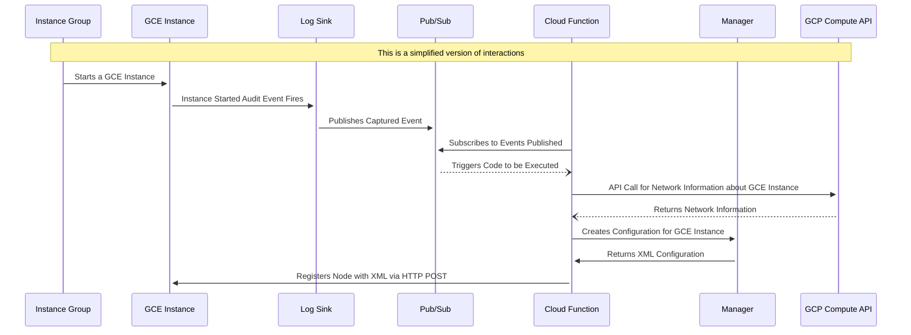

I wanted to write this post for quite sometime and am now finally getting around to it.

I'm going to briefly talk about the process I undertook in migrating an "on prem" video communication vendor from AWS to GCP, as well as how I automated the painful manual parts of scaling the service using events, pubsub, and serverless.

## The Application

The application hosts video communication software, think Zoom, that connects customers and employees. The software is delivered as a [tar][tar] file which they provide as input to build an ElasticCompute 2 (EC2) or Google Compute Engine (GCE) image (read: a Virtual Machine (VM) image).

The app is comprised of the following components:

- Proxy nodes: Most be publicly routable, they proxy connections on multiple ports to Transcoder nodes.
- Transcoder nodes: Compute heavy, these nodes handle the call transcoding.
- Manager node: A single node (no HA) that handles scheduling calls and common administrative tasks.

All of these are VM appliances packaged as tar files by the software provider.

### Enrollment

Once the Manager node is bootstrapped, a manual process that I won’t dive into here, Proxy and Transcoder nodes can be provisioned. The `manual` provisioning steps looks something like this:

1. Within the Manager GUI create the configuration entry form for the node to be provisioned
   - This contains attributes such as, `hostname`, `ip-address`, `node-type`, etc
2. The form generates an XML file containing the configuration of the node being provisioned
3. The XML file must then to be sent over the network via an HTTP POST to the new node, on port `8443`

When I originally joined this company, the process was completely manual. You can imagine how long it’d take to provision 10+ nodes in a scale-up or scale-down event!

The rest of this post will talk about the steps I took to automate this process using Terraform and an event-driven architecture design.

## Infrastructure

The core components in both AWS and GCP are the same. The technology simply uses Cloud Compute resources (EC2 vs GCE) to run images launched on a network with internal connectivity (typically within a VPC) and routable externally via statically assigned IP addresses (only required on Proxy nodes).

### Old - AWS

The original AWS infrastructure was setup manually and rather quickly, without a lot of understanding about how the application works.

Because of the requirements of the application, and due to how AWS EC2 handles NUMA vCPUs the AWS EC2 instances actually had to be deployed onto dedicated hosts to avoid any potential issues with other VM guests on the shared physical (server) resources.

### New - GCP

I created the GCP infrastructure fully in Terraform; primarily comprised of Managed Instance Groups (MIGS) running Google Compute Engine Instances (GCE).

Very simple. The more exciting piece was the use of Google Cloud Platform's EventArc service to automatically react to published events, (think a GCE instance starts) and react to them using Serverless hooks.

## Automation

Recall the manual setup process discussed in the [Enrollment](#enrollment) section. After the Proxy or Conference node is brought online, they need to be "enrolled" with the Manager.

This allows the Manager to generate the XML file and provide it back to the Proxy or Conference node so that it knows its own configurations and ultimately, what to connect to.

### Driving Action with Events

Thankfully with the use of standard audit events published to GCP Cloud Logging, we were able to "catch" and react when certain things within GCP happened.

From a high level, the process looks like this:



### More Detail

The below is half for my own record to easily remember. For those curious about the details, please read on.

1. GCE Instance added to GCE MIG
   - Triggers `compute.instances.insert` Audit Event
1. GCP [Log Router Sink][sink] captures `compute.instances.insert` message
   - Publishes these events to a Pub/Sub topic as JSON, with useful details like project, ID of GCE Instance, etc
1. The Pub/Sub topic is subscribed to by a Cloud Function
1. The Cloud Function interacts with GCP’s APIs to query information about the ID of the GCE Instance in Pub/Sub topic
   - Retrieve information such as IP, Gateway, Hostname, Metadata
   - Metadata is used to determine what type of node this is, Transcoder or Proxy?
1. The Cloud Function sends the data via HTTP POST to the Manager
   - This creates the initial configuration entry with the Manager
   - This returns an XML binary data
1. The Cloud Function sends an HTTP POST request GCE Instance that was just added, on port 8443.
   - The code making the request is configured to retry with incremental backoffs for up to 10minutes
   - This is due to the whole process so far described happening very quickly
1. The GCE Instance (eventually) returns success
   - The node appears within the Manager’s GUI and begins to fully synchronize its configurations.

#### Example Log Router Query

My goal is to make the explaination of this as straight forward as possible. To further that purpose, the Log Router Sink query might look something like this:

```
log_name="projects/my-project-755/logs/cloudaudit.googleapis.com%2Factivity"
operation.first="true"
protoPayload.methodName="v1.compute.instances.insert"
protoPayload.resourceName=~"projects/my-project-123/zones/us-east1-[a-z]/instances/vendor-(proxy|transcoder)-.*"
```

In the field piece of the query, `protoPayload.resourceName`, I'm filtering out GCE instances using regex on the name of the GCE instance being created.

### In Conclusion

This is one part of a two part process, with its mirror being "deregistration" of GCE instances with the Manager when a GCE instance is terminated.. however, I won't cover that here.

Stringing together all of these inputs and outputs was really interesting - as my first foray into working with GCP services, it was really pleasant.

[tar]: https://en.wikipedia.org/wiki/Tar_(computing)
[sink]: https://cloud.google.com/logging/docs/routing/overview#sinks
